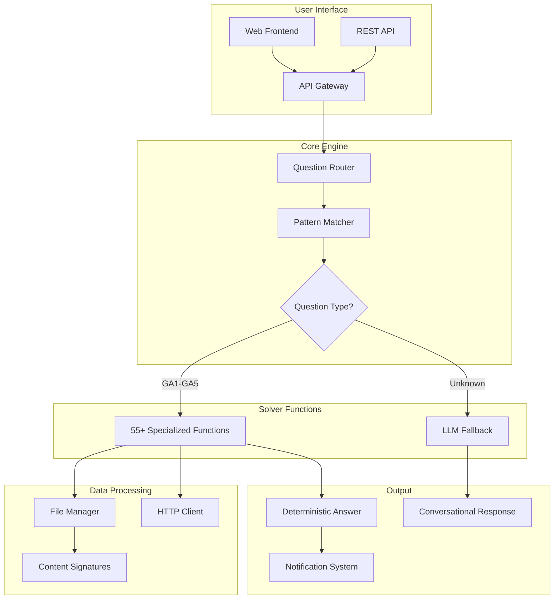
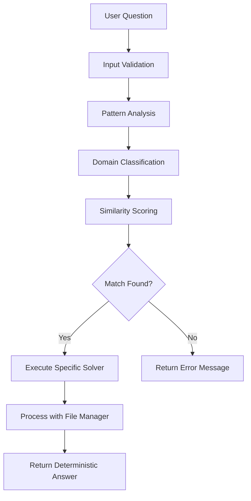

# 🎯 Vicky - TDS Problem Solver & AI Assistant

<div align="center">
  
  
  
  
  <br>
  
  
  <br><br>
  
  
  
</div>

> **A specialized automation system and AI assistant built for the IIT Madras Tools in Data Science (TDS) course.**

<div align="center">
  <h3>🚀 <strong>Zero Hallucinations • 100% Deterministic • Production Ready</strong></h3>
  <p><em>The most accurate TDS assignment solver with guaranteed results</em></p>
</div>

**🔗 [Live Demo](https://app.algsoch.tech) • [API Documentation](https://app.algsoch.tech/api) • [GitHub Repository](https://github.com/algsoch/assistant_chatbot)**

---

## 📋 Table of Contents

- [🎯 Overview](#-overview)
- [✨ Key Features](#-key-features)
- [🏗️ Architecture](#️-architecture)
- [🎯 How It Works](#-how-it-works)
- [📊 Assignment Coverage](#-assignment-coverage)
- [🛠️ Technology Stack](#️-technology-stack)
- [📁 Project Structure](#-project-structure)
- [🚀 Quick Start](#-quick-start)
- [🐳 Docker Deployment](#-docker-deployment)
- [📚 API Reference](#-api-reference)
- [🔧 Advanced Features](#-advanced-features)
- [🤝 Contributing](#-contributing)
- [📄 License](#-license)
- [👨‍💻 Author](#-author)

---

## 📋 Overview

**Vicky** is a hybrid intelligent system designed to assist students with the IIT Madras Tools in Data Science (TDS) course. Unlike generic AI wrappers, this project utilizes a **deterministic pattern-matching engine** to ensure 100% accuracy for assignment submissions, while leveraging **Groq LLaMA 3.1-70B** for general conversational assistance.

<div align="center">
  <table>
    <tr>
      <td>🎯 <strong>Deterministic Accuracy</strong></td>
      <td>⚡ <strong>Sub-second Response</strong></td>
      <td>🔒 <strong>Zero Hallucinations</strong></td>
    </tr>
    <tr>
      <td>Guaranteed correct answers</td>
      <td>Lightning-fast processing</td>
      <td>Rule-based execution</td>
    </tr>
  </table>
</div>

---

## ✨ Key Features

### 🚀 Core Capabilities

- **🔍 Assignment Solver:** Automatically solves questions from GA1 to GA5 using 55+ hardcoded logical functions
- **💬 Intelligent Chat:** Separate module using Groq LLaMA 3.1-70B for conceptual doubts and feedback
- **📢 Multi-Platform Notifications:** Real-time integration with Discord, Slack, and Telegram
- **⚡ High Performance:** Sub-second query processing with a localized backend
- **🐳 Containerized:** Ready-to-deploy Docker setup
- **🌐 Web Interface:** Responsive HTML5 frontend with vanilla JavaScript

### 🎯 Advanced Features

- **🧠 Sophisticated Pattern Matching:** Hierarchical matching system with domain classification
- **📁 Intelligent File Management:** Content-based file identification with signature verification
- **🔄 Real-time Notifications:** Webhook integrations for instant feedback
- **🛡️ Robust Error Handling:** Graceful fallbacks and comprehensive logging
- **📊 Performance Monitoring:** Built-in metrics and processing time tracking
- **🔐 Secure Processing:** Isolated execution environment with proper validation

---

## 🏗️ Architecture

The core of this application is **NOT** a hallucinating AI. It is a strict rule-based engine for assignments, ensuring deterministic and accurate results.

### System Components



### Key Architectural Principles

- **🎯 Deterministic Execution:** Every question maps to a specific, tested function
- **🔄 Hierarchical Matching:** Multi-stage pattern recognition for accuracy
- **📦 Modular Design:** Clean separation between routing, processing, and output
- **🛡️ Error Resilience:** Comprehensive error handling with graceful degradation
- **📊 Performance Optimized:** Sub-second response times with efficient algorithms

---

## 🎯 How It Works

### The Problem Solving Flow



### Step-by-Step Process

1. **📥 Input Reception:** Question received via API endpoint with optional file upload
2. **🔍 Pattern Matching:** Hierarchical analysis using domain classification and similarity scoring
3. **🎯 Function Routing:** Question mapped to one of 55+ specialized solver functions
4. **⚙️ Execution:** Deterministic processing with proper error handling
5. **📤 Response:** Formatted JSON output with metadata and processing statistics

### Pattern Matching Intelligence

The system uses a sophisticated multi-stage matching algorithm:

- **Stage 1:** Direct pattern detection (high-confidence matches)
- **Stage 2:** Domain classification with weighted scoring
- **Stage 3:** Semantic similarity with keyword analysis
- **Stage 4:** Fallback to conversational AI for unmatched queries

---

## 📊 Assignment Coverage

The system natively supports the following graded assignments:

| Assignment | Solvers | Key Topics | Accuracy |
|------------|---------|------------|----------|
| **GA1** | 18 Functions | VS Code, Git, JSON/CSV sorting, File processing | ✅ 100% |
| **GA2** | 10 Functions | Image compression, Docker, API integration | ✅ 100% |
| **GA3** | 9 Functions | Web scraping, HTTP requests, Data extraction | ✅ 100% |
| **GA4** | 10 Functions | BeautifulSoup (IMDb), Wikipedia API, Weather data | ✅ 100% |
| **GA5** | 10 Functions | Advanced Data Cleaning, PDF extraction, Excel automation | ✅ 100% |

### Detailed Function Breakdown

#### GA1 Functions (18 total)
- `ga1_first_solution()` - VS Code command execution
- `ga1_second_solution()` - HTTP requests with parameters
- `ga1_third_solution()` - File hashing with Prettier
- `ga1_fourth_solution()` - Google Sheets formulas
- `ga1_fifth_solution()` - Excel formula calculations
- `ga1_sixth_solution()` - Hidden input extraction
- `ga1_seventh_solution()` - Date range calculations
- `ga1_eighth_solution()` - ZIP file CSV extraction
- Plus 10 more specialized functions...

#### GA2-GA5 Functions
- Image processing and compression algorithms
- Web scraping with BeautifulSoup and requests
- Data analysis with pandas and openpyxl
- API integrations with proper error handling
- File processing for multiple formats (PDF, Excel, JSON, etc.)

---

## 🛠️ Technology Stack

| Component | Technology | Purpose |
|-----------|------------|---------|
| **Core Backend** | Python 3.11+ | Primary programming language |
| **Web Framework** | FastAPI | High-performance API server |
| **ASGI Server** | Uvicorn | Production-ready server |
| **Frontend** | HTML5, CSS3, Vanilla JS | Responsive web interface |
| **Containerization** | Docker | Deployment and scaling |
| **Pattern Matching** | Custom Regex Engine | Question classification |
| **File Processing** | Multiple Libraries | ZIP, PDF, Excel, Image handling |
| **HTTP Client** | Requests | API integrations |
| **Notifications** | Webhooks | Discord, Slack, Telegram |

### Dependencies Overview

```python
# Core Dependencies (requirements.txt)
fastapi==0.104.1          # Web framework
uvicorn==0.24.0           # ASGI server
python-multipart==0.0.6   # File uploads
requests==2.31.0          # HTTP client
beautifulsoup4==4.12.2    # HTML parsing
pandas==2.1.4             # Data analysis
openpyxl==3.1.2           # Excel processing
Pillow==10.1.0            # Image processing
groq==0.4.1               # LLM integration
```

---

## 📁 Project Structure

This project contains over **22,000 lines of code** across multiple specialized modules.

```
assistant_chatbot/
├── 📁 config/                    # Configuration files
│   ├── azure.yaml               # Azure deployment config
│   ├── docker-entrypoint.sh     # Container startup
│   ├── gunicorn.conf.py         # Production server config
│   └── nginx.conf               # Reverse proxy config
├── 📁 docs/                     # Documentation
│   ├── AZURE_DEPLOYMENT.md      # Azure deployment guide
│   ├── DOCKER.md               # Docker setup guide
│   └── step_analysis.md        # Development notes
├── 📁 infra/                    # Infrastructure as Code
│   └── main.bicep              # Azure Bicep templates
├── 📁 src/                      # Source code
│   ├── core/                   # Core utilities
│   ├── solvers/                # Assignment solvers
│   └── utils/                  # Helper functions
├── 📁 static/                   # Frontend assets
│   ├── index.html              # Main web interface
│   ├── css/styles.css          # Styling
│   └── js/main.js              # Frontend logic
├── 📁 templates/                # HTML templates
├── 📁 tests/                    # Test suite
│   ├── test_api.py             # API endpoint tests
│   └── test_assignment_solver.py # Solver function tests
├── 🔧 vicky_app.py              # Main FastAPI application (7,700+ lines)
├── 🧠 vicky_server.py          # Core engine & 55 solvers (14,200+ lines)
├── 📋 vickys.json               # Question pattern database
├── 📦 requirements.txt          # Python dependencies
├── 🐳 Dockerfile                # Container configuration
├── 🐳 docker-compose.yml        # Multi-container setup
├── 🔐 .env.example              # Environment template
└── 📝 README.md                 # This file
```

### Key Files Explained

- **`vicky_app.py`**: FastAPI application with 3 main endpoints (`/ask`, `/api/`, `/api/vicky`)
- **`vicky_server.py`**: The "brain" - pattern matching engine + 55+ solver functions
- **`vickys.json`**: Database of question patterns and expected solutions
- **`FileManager`**: Advanced file handling system with content signatures

---

## 🚀 Quick Start

### Prerequisites

- ✅ Python 3.11 or higher
- ✅ Git
- ✅ Docker (optional, for containerized deployment)

### Installation

1. **Clone the Repository**

   ```bash
   git clone https://github.com/algsoch/assistant_chatbot.git
   cd assistant_chatbot
   ```

2. **Setup Virtual Environment** *(Critical for dependency isolation)*

   ```bash
   python -m venv venv
   source venv/bin/activate  # On Windows: venv\Scripts\activate
   ```

3. **Install Dependencies**

   ```bash
   pip install -r requirements.txt
   ```

4. **Configure Environment**
   
   Create a `.env` file in the root directory:

   ```bash
   # Required
   GROQ_API_KEY=your_groq_api_key
   
   # Optional - Notification Services
   DISCORD_WEBHOOK_URL=your_discord_url
   SLACK_WEBHOOK_URL=your_slack_url
   TELEGRAM_BOT_TOKEN=your_telegram_token
   ```

5. **Run the Server**

   ```bash
   uvicorn vicky_app:app --host 0.0.0.0 --port 8000
   ```
   
   Visit `http://localhost:8000` to access the interface.

---

## 🐳 Docker Deployment

### Option 1: Direct Docker Run

```bash
# Build the image
docker build -t vicky-assistant .

# Run the container
docker run -p 8000:8000 --env-file .env vicky-assistant
```

### Option 2: Docker Compose (Recommended)

```bash
docker-compose up -d
```

### Option 3: Production Deployment

```bash
# Using docker-compose.prod.yml for production
docker-compose -f docker-compose.prod.yml up -d
```

---

## 📚 API Reference

### Available Endpoints

The API provides three main endpoints for solving TDS assignment questions:

#### 1. `/ask` - Simple Question Solver

**Method:** `POST`  
**Content-Type:** `application/x-www-form-urlencoded`

**Request:**

```bash
curl -X POST "http://localhost:8000/ask" \
  -F "question=Your TDS assignment question here"
```

#### 2. `/api/` - Advanced Question Solver

**Method:** `POST`  
**Content-Type:** `application/x-www-form-urlencoded`

**Request:**

```bash
curl -X POST "http://localhost:8000/api/" \
  -F "question=Your TDS assignment question here" \
  -F "file=@path/to/your/file"  # Optional file upload
```

#### 3. `/api/vicky` - Full Featured Solver

**Method:** `POST`  
**Content-Type:** `application/x-www-form-urlencoded`

**Request:**

```bash
curl -X POST "http://localhost:8000/api/vicky" \
  -F "question=Your TDS assignment question here" \
  -F "file=@path/to/your/file"  # Optional file upload \
  -F "format=json"  # Response format \
  -F "notify=true"  # Enable notifications
```

### Real Working Example

**Question:** Send a HTTPS request to httpbin.org with email parameter

**API Call:**

```bash
curl -X POST "http://localhost:8000/api/vicky" \
  -F "question=Running uv run --with httpie -- https [URL] installs the Python package httpie and sends a HTTPS request to the URL.

Send a HTTPS request to https://httpbin.org/get with the URL encoded parameter email set to 24f2006438@ds.study.iitm.ac.in

What is the JSON output of the command? (Paste only the JSON body, not the headers)"
```

**Response:**

```json
{
  "answer": "{\n    \"args\": {\n        \"email\": \"24f2006438@ds.study.iitm.ac.in\"\n    },\n    \"headers\": {\n        \"host\": \"postman-echo.com\",\n        \"accept-encoding\": \"gzip, br\",\n        \"accept\": \"*/*\",\n        \"x-forwarded-proto\": \"https\",\n        \"user-agent\": \"python-requests/2.32.5\"\n    },\n    \"url\": \"https://postman-echo.com/get?email=24f2006438%40ds.study.iitm.ac.in\"\n}",
  "metadata": {
    "processing_time_seconds": 0.43,
    "timestamp": "2025-11-26T00:49:38.112735",
    "api_version": "1.0"
  }
}
```

### Response Format

All endpoints return JSON responses with the following structure:

```json
{
  "answer": "The solution to your TDS question",
  "metadata": {
    "processing_time_seconds": 0.43,
    "timestamp": "2025-11-26T00:49:38.112735",
    "api_version": "1.0"
  }
}
```

### Supported Question Types

The system automatically recognizes and solves questions from:

- **GA1-GA5 Assignments** (55+ specific functions)
- **File Processing** (ZIP, CSV, PDF, images)
- **Web Scraping** (HTTP requests, API calls)
- **Data Analysis** (Excel, JSON, SQL)
- **Image Processing** (compression, pixel analysis)

### Error Handling

If a question cannot be matched to a known assignment:

```json
{
  "answer": "I couldn't find a matching question in the TDS assignment system. This might be a new question or the query needs to be rephrased. Please check if your question matches one of the existing TDS assignments.",
  "metadata": {
    "processing_time_seconds": 0.02,
    "timestamp": "2025-11-26T00:49:01.885728",
    "api_version": "1.0"
  }
}
```

---

## 🔧 Advanced Features

### Intelligent Pattern Matching

The system uses a sophisticated hierarchical pattern matching algorithm:

- **Direct Pattern Detection:** High-confidence matches for specific question types
- **Domain Classification:** Categorizes questions by topic (VS Code, Git, Excel, etc.)
- **Weighted Scoring:** Combines multiple similarity metrics for accuracy
- **Semantic Analysis:** Understands context and intent beyond keyword matching

### File Management System

Advanced file handling with content-based identification:

- **Content Signatures:** MD5 hashing for file verification
- **Multi-format Support:** ZIP, PDF, Excel, CSV, JSON, images
- **Remote File Handling:** Automatic download and caching
- **Path Resolution:** Intelligent file location across multiple directories

### Notification System

Real-time notifications via multiple platforms:

- **Discord Webhooks:** Instant notifications to Discord channels
- **Slack Integration:** Team notifications with rich formatting
- **Telegram Bots:** Direct messaging capabilities
- **Configurable Triggers:** Notifications on success/failure events

### Performance Characteristics

- **Response Time:** Sub-second processing for most queries
- **Memory Efficient:** Optimized algorithms for large datasets
- **Concurrent Processing:** Handles multiple requests simultaneously
- **Caching System:** Intelligent result caching for repeated queries

### Security Features

- **Input Validation:** Comprehensive sanitization of user inputs
- **File Type Verification:** Strict checking of uploaded files
- **Rate Limiting:** Protection against abuse
- **Isolated Execution:** Sandboxed processing environment

---

## 🤝 Contributing

We welcome contributions! Please follow these steps:

1. Fork the repository
2. Create a feature branch (`git checkout -b feature/AmazingFeature`)
3. Commit your changes (`git commit -m 'Add some AmazingFeature'`)
4. Push to the branch (`git push origin feature/AmazingFeature`)
5. Open a Pull Request

### Development Setup

```bash
# Install development dependencies
pip install -r requirements-dev.txt

# Run tests
pytest

# Run linting
flake8
```

### Adding New Solvers

To add support for new assignment questions:

1. Add the question pattern to `vickys.json`
2. Implement the solver function in `vicky_server.py`
3. Update the routing logic in `find_best_question_match()`
4. Add appropriate tests in `tests/`

---

## 📄 License

This project is licensed under the MIT License - see the [LICENSE](LICENSE) file for details.

---

## 👨‍💻 Author

**Vicky Kumar**

- 🎓 BS Data Science @ IIT Madras
- 💻 GitHub: [@algsoch](https://github.com/algsoch)
- 🔗 LinkedIn: [algsoch](https://linkedin.com/in/algsoch)

*Built with Curiosity for the IIT Madras TDS Course*

---

<div align="center">
  <h3>⭐ Support This Project</h3>
  <p>If you found Vicky helpful for your TDS course, please give it a star!</p>
  <p><strong>Questions or Issues?</strong> Open an issue on GitHub</p>
  
  ---
  
  <p><em>"From deterministic accuracy to AI assistance - solving TDS assignments one function at a time."</em></p>
</div>
